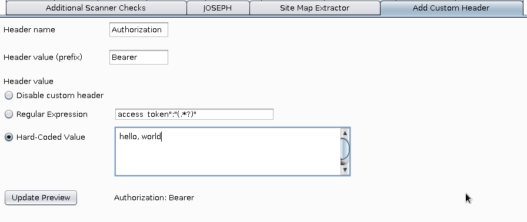
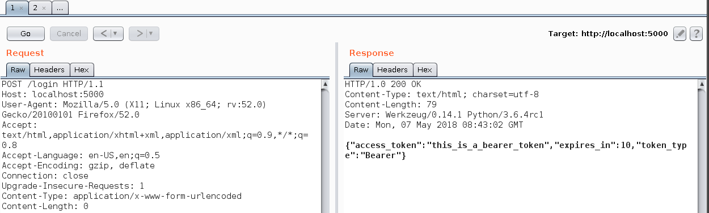
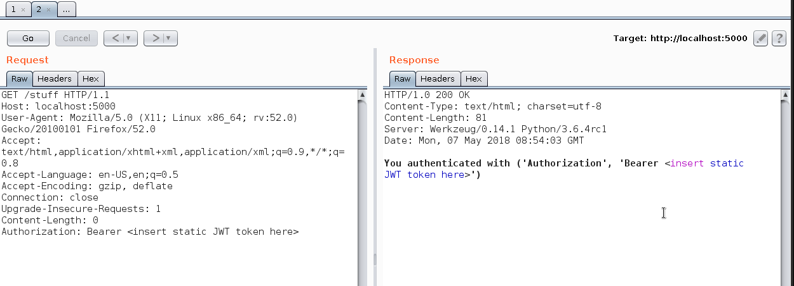

# Add a custom HTTP header in Burp

## Quickstart:

If you trust this JAR file:

 1. Open the Extender tab
 2. Select "Extensions" 
 3. Select "Add" and pick the jar file from this repository

If you don't trust the jar file (and why should you), instructions on how to compile it are below. 

Usage:

 1. After installed, select the "Add Custom Header" tab and pick a
    regular expression or a hard-coded value as shown below. Keep in
    mind the regular expression makes sense only when using a macro, so
    try a hard-coded value first.
   
 2. The defaults are OK for a JWT-like "Bearer" token
 3. Select Project Options -> Sessions
 4. Add a Session Handling rule
 5. Name it and select "Add", "Invoke a Burp Extension"
   
 6. Make sure the scope is correct! If you're just trying this out,
    select 'include all URLs' in the scope (not recommended for regular
    use). 
 7. Select the "Add Bearer Token" option from the list in the following
    screen

You're now ready to go.

## Testing with a mock server

Run this to start a Python webserver on 127.0.0.1:5000:

    FLASK_DEBUG=1 FLASK_APP=server.py flask run

The mock webserver will issue a "bearer token" on `/login` and
echo back the bearer token received on `/stuff`.  

See the following screenshots for examples of how to interact with the
mock server.

POST to `/login`:

 

Using the token when accessing `/stuff`:

## Compilation from source

 0. Clone this repo
 1. Burp -> Extender -> APIs
 2. Select "Save interface files" from the bottom of the screen and
    select a temporary location
 3. Copy all `*.java` files into the `burp` directory containing this
    repo source
 4. Compile the source: 
        mkdir build ; javac -d build burp/BurpExtender.java burp/BurpTab.java
 5. Create a JAR file: 
  	cd build ; jar cvf ../out.jar .
 6. Install the `out.jar` file into Burp

To design the GUI I've used Netbeans. The BurpTab.form file should be
enough to recreate it.

